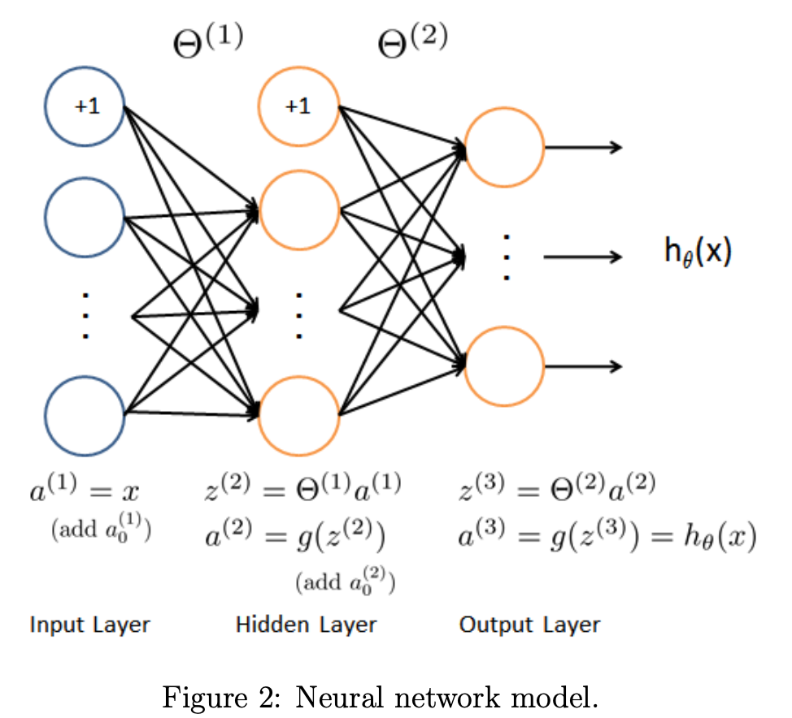

[ML Home](../index.html)

```{r setup, include=FALSE}
knitr::opts_chunk$set(echo = TRUE)
```

```{r message=FALSE, warning=FALSE}
library(tidyverse)
```

Building this neural network.


# Coursera Tutorial for predict()

Here is an outline for forward propagation using the vectorized method. This is an implementation of the formula in Figure 2 on Page 11 of ex3.pdf.

1. Add a column of 1's to X (the first column), and it becomes 'a1'.
2. Multiply by Theta1 and you have 'z2'. 
3. Compute the sigmoid() of 'z2', then add a column of 1's, and it becomes 'a2'
4. Multiply by Theta2, compute the sigmoid() and it becomes 'a3'.
5. Now use the max(a3, [], 2) function to return two vectors - one of the highest value for each row, and one with its index. Ignore the highest values. Keep the vector of the indexes where the highest values were found. These are your predictions.

Note: When you multiply by the Theta matrices, you'll have to **use transposition** to get a result that is the correct size.

Note: The predictions must be returned as a column vector - size (m x 1). If you return a row vector, the script will not compute the accuracy correctly.

Note: Not getting the correct results? In the hidden layer, be sure you use sigmoid() first, then add the bias unit. 

------ dimensions of the variables ---------

a1 is (m x n), where 'n' is the number of features including the bias unit

Theta1 is (h x n) where 'h' is the number of hidden units

a2 is (m x (h + 1))

Theta2 is (c x (h + 1)), where 'c' is the number of labels.

a3 is (m x c)

p is a vector of size (m x 1)

[Source of notes](https://www.coursera.org/learn/machine-learning/discussions/weeks/4/threads/miam5q2IEeWhLRIkesxXNw)

***

# predict

predict(Theta1, Theta2, X)

## Test Case
```
Theta1 = reshape(sin(0 : 0.5 : 5.9), 4, 3); % Theta1 is Theta^(1)
Theta2 = reshape(sin(0 : 0.3 : 5.9), 4, 5); % Theta^(2)
X = reshape(sin(1:16), 8, 2);
p = predict(Theta1, Theta2, X)
% you should see this result
% p = 
%   4
%   1
%   1
%   4
%   4
%   4
%   4
%   2
% Here are the values for the "a3" layer in the test case for predict().

% a3 =

%    0.53036   0.54588   0.55725   0.56352
%    0.54459   0.54298   0.53754   0.52875
%    0.49979   0.49616   0.49288   0.49024
%    0.41357   0.42199   0.43736   0.45844
%    0.37321   0.40368   0.44349   0.48911
%    0.42073   0.45935   0.50210   0.54464
%    0.50962   0.53216   0.55173   0.56659
%    0.54882   0.55033   0.54738   0.54021
```

# References

- [Programming Tutorials](https://www.coursera.org/learn/machine-learning/discussions/weeks/4/threads/miam5q2IEeWhLRIkesxXNw)
- [Test Case](https://www.coursera.org/learn/machine-learning/discussions/all/threads/5g8LaZTCEeW0dw6k4EUmPw)
